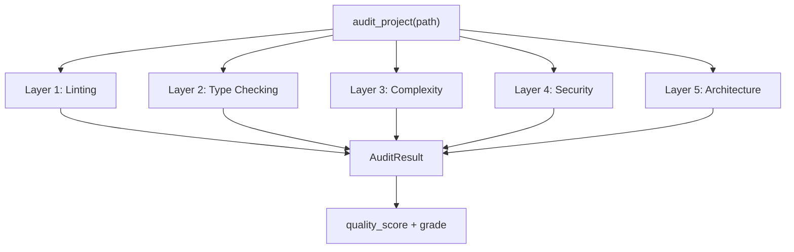

# 5-Layer Architecture

axm-audit implements the **SOTA 5-layer quality assessment** model (2024-2025 standards) for Python projects.

## Overview

## Layer Details

### Layer 1 — Linting (Ruff)

**Weight:** 25% · **Rule:** `LintingRule`

Static analysis with 800+ rules via [Ruff](https://docs.astral.sh/ruff/). Catches style violations, potential bugs, and anti-patterns at 10-100x the speed of traditional linters.

### Layer 2 — Type Checking (MyPy)

**Weight:** 30% · **Rule:** `TypeCheckRule`

Strict mode type checking via [MyPy](https://mypy.readthedocs.io/). Verifies type annotations, catches `None`-safety issues, and enforces typed interfaces.

### Layer 3 — Complexity (Radon)

**Weight:** 20% · **Rule:** `ComplexityRule`

Cyclomatic complexity analysis via [Radon](https://radon.readthedocs.io/). Flags functions with CC ≥ 10 as too complex. Measures maintainability.

### Layer 4 — Security (Bandit)

**Weight:** 15% · **Rule:** `SecurityRule`

Vulnerability scanning via [Bandit](https://bandit.readthedocs.io/). Detects hardcoded secrets, SQL injection patterns, unsafe deserialization, and more.

### Layer 5 — Architecture (AST)

**Weight:** 10% (via structure score) · **Rules:** `CircularImportRule`, `GodClassRule`, `CouplingMetricRule`

AST-based structural analysis detecting:

- **Circular imports** — dependency cycles between modules
- **God classes** — classes with too many methods/attributes
- **High coupling** — excessive inter-module dependencies

## Additional Rule Categories

Beyond the 5 quality layers, axm-audit includes:

- **Structure rules** — verify `pyproject.toml`, `README.md`, `src/`, `tests/` exist
- **Practice rules** — docstring coverage, bare except detection, security patterns
