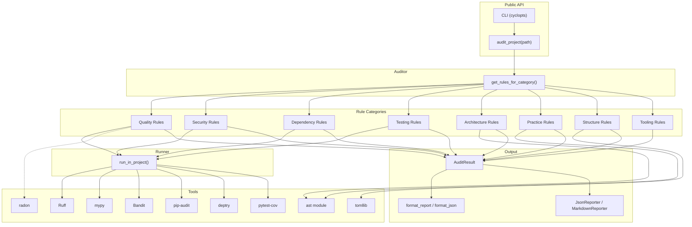
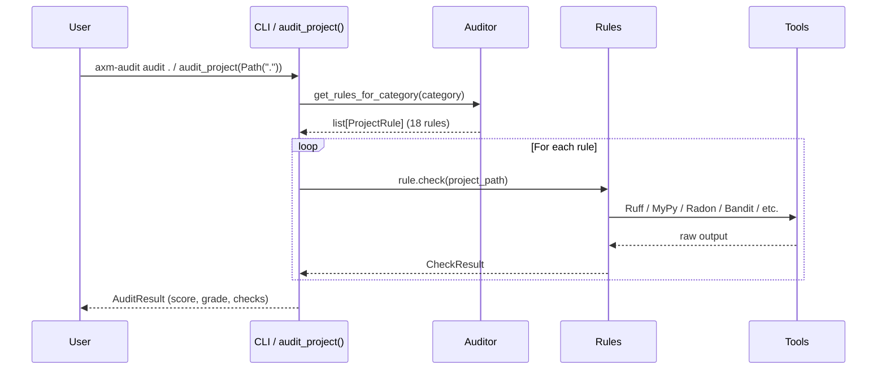

# Architecture

## Overview

`axm-audit` follows a layered architecture with clear separation of concerns:

## Layers

### 1. Public API

- **CLI** — `axm-audit audit .` via cyclopts
- **`audit_project()`** — Python entry point
- **`get_rules_for_category()`** — Get rule instances, optionally filtered

Both return typed Pydantic models for safe agent consumption.

### 2. Rule Engine

`get_rules_for_category()` returns rule instances from the `RULES_BY_CATEGORY` registry:

| Category | Rules | Count |
|---|---|---|
| `quality` | `LintingRule`, `FormattingRule`, `TypeCheckRule`, `ComplexityRule` | 4 |
| `security` | `SecurityRule` | 1 |
| `dependencies` | `DependencyAuditRule`, `DependencyHygieneRule` | 2 |
| `testing` | `TestCoverageRule` | 1 |
| `architecture` | `CircularImportRule`, `GodClassRule`, `CouplingMetricRule` | 3 |
| `practice` | `DocstringCoverageRule`, `BareExceptRule`, `SecurityPatternRule` | 3 |
| `structure` | `PyprojectCompletenessRule` | 1 |
| `tooling` | `ToolAvailabilityRule` | 3 instances |

**Total: 18 rule instances across 8 categories.**

### 3. Tool Integration

All subprocess-based rules use `run_in_project()` from `core/runner.py`, which detects the target project's `.venv/` and executes tools via `uv run --directory` to ensure the correct environment is used.

| Rule | Tool | Integration |
|---|---|---|
| `LintingRule` | Ruff | `run_in_project(["ruff", "check", ...])` |
| `FormattingRule` | Ruff | `run_in_project(["ruff", "format", "--check", ...])` |
| `TypeCheckRule` | MyPy | `run_in_project(["mypy", ...])` |
| `ComplexityRule` | Radon | `radon.complexity.cc_visit(source)` |
| `SecurityRule` | Bandit | `run_in_project(["bandit", ...])` |
| `DependencyAuditRule` | pip-audit | `run_in_project(["pip-audit", ...])` |
| `DependencyHygieneRule` | deptry | `run_in_project(["deptry", ...])` |
| `TestCoverageRule` | pytest-cov | `run_in_project(["pytest", "--cov", ...])` |
| Architecture rules | Python `ast` | Direct AST parsing |
| Structure rules | `tomllib` | TOML parsing |
| `ToolAvailabilityRule` | `shutil.which` | PATH lookup |

### 4. Scoring

8-category weighted composite (see [Scoring & Grades](scoring.md)):

| Category | Weight |
|---|---|
| Linting | 20% |
| Type Safety | 15% |
| Complexity | 15% |
| Security | 10% |
| Dependencies | 10% |
| Testing | 15% |
| Architecture | 10% |
| Practices | 5% |

### 5. Models

`AuditResult`, `CheckResult`, `Severity` — Pydantic models with `extra = "forbid"` for strict validation.

### 6. Output

- **Formatters**: `format_report()` (human-readable), `format_json()` (machine-readable), `format_agent()` (agent-optimized)
- **Reporters**: `JsonReporter`, `MarkdownReporter` for rendering `AuditResult`

## Data Flow

