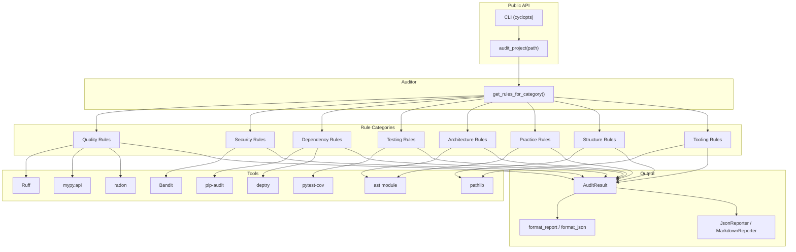

# Architecture

## Overview

`axm-audit` follows a layered architecture with clear separation of concerns:

## Layers

### 1. Public API

- **CLI** — `axm-audit audit .` via cyclopts
- **`audit_project()`** — Python entry point
- **`get_rules_for_category()`** — Get rule instances, optionally filtered

Both return typed Pydantic models for safe agent consumption.

### 2. Rule Engine

`get_rules_for_category()` returns rule instances from the `RULES_BY_CATEGORY` registry:

| Category | Rules | Count |
|---|---|---|
| `quality` | `LintingRule`, `TypeCheckRule`, `ComplexityRule` | 3 |
| `security` | `SecurityRule` | 1 |
| `dependencies` | `DependencyAuditRule`, `DependencyHygieneRule` | 2 |
| `testing` | `TestCoverageRule` | 1 |
| `architecture` | `CircularImportRule`, `GodClassRule`, `CouplingMetricRule` | 3 |
| `practice` | `DocstringCoverageRule`, `BareExceptRule`, `SecurityPatternRule` | 3 |
| `structure` | `PyprojectCompletenessRule` | 1 |
| `tooling` | `ToolAvailabilityRule` | 3 instances |

**Total: 17 rule instances across 8 categories.**

### 3. Tool Integration

Each rule wraps an external tool using Python APIs where possible:

| Rule | Tool | Integration |
|---|---|---|
| `LintingRule` | Ruff | `subprocess.run([sys.executable, "-m", "ruff", ...])` |
| `TypeCheckRule` | MyPy | `mypy.api.run(["--output", "json", ...])` |
| `ComplexityRule` | Radon | `radon.complexity.cc_visit(source)` |
| `SecurityRule` | Bandit | `subprocess.run(["bandit", "-r", "-f", "json", ...])` |
| `DependencyAuditRule` | pip-audit | `subprocess.run([..., "-m", "pip_audit", ...])` |
| `DependencyHygieneRule` | deptry | `subprocess.run([..., "-m", "deptry", ...])` |
| `TestCoverageRule` | pytest-cov | `subprocess.run([..., "-m", "pytest", "--cov", ...])` |
| Architecture rules | Python `ast` | Direct AST parsing |
| Structure rules | `tomllib` | TOML parsing |
| `ToolAvailabilityRule` | `shutil.which` | PATH lookup |

### 4. Scoring

6-category weighted composite (see [Scoring & Grades](scoring.md)):

| Category | Weight |
|---|---|
| Linting | 20% |
| Type Safety | 20% |
| Complexity | 15% |
| Security | 15% |
| Dependencies | 15% |
| Testing | 15% |

### 5. Models

`AuditResult`, `CheckResult`, `Severity` — Pydantic models with `extra = "forbid"` for strict validation.

### 6. Output

- **Formatters**: `format_report()` (human-readable), `format_json()` (machine-readable)
- **Reporters**: `JsonReporter`, `MarkdownReporter` for rendering `AuditResult`

## Data Flow

