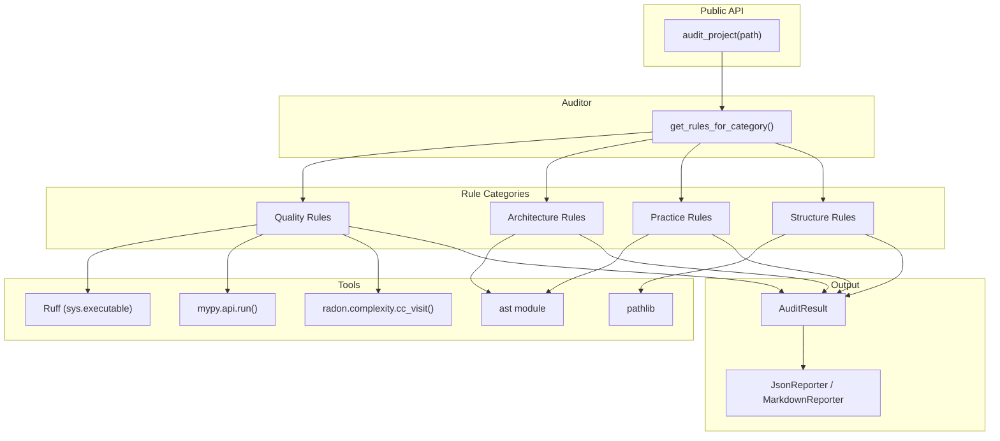
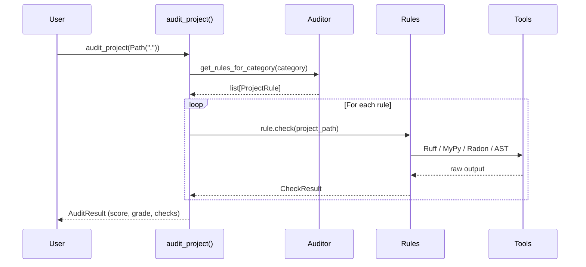

# Architecture

## Overview

`axm-audit` follows a layered architecture with clear separation of concerns:

## Layers

### 1. Public API

- **`audit_project()`** — Main entry point (`__init__.py`)
- **`get_rules_for_category()`** — Get rule instances, optionally filtered

Both return typed Pydantic models for safe agent consumption.

### 2. Rule Engine

`get_rules_for_category()` returns rule instances from the `RULES_BY_CATEGORY` registry:

| Category | Rules |
|---|---|
| `quality` | `LintingRule`, `TypeCheckRule`, `ComplexityRule` |
| `architecture` | `CircularImportRule`, `GodClassRule`, `CouplingMetricRule` |
| `practice` | `DocstringCoverageRule`, `BareExceptRule`, `SecurityPatternRule` |
| `structure` | `FileExistsRule`, `DirectoryExistsRule` |

### 3. Tool Integration

Each rule wraps an external tool using Python APIs where possible:

| Rule | Tool | Integration |
|---|---|---|
| `LintingRule` | Ruff | `subprocess.run([sys.executable, "-m", "ruff", ...])` |
| `TypeCheckRule` | MyPy | `mypy.api.run(["--output", "json", ...])` |
| `ComplexityRule` | Radon | `radon.complexity.cc_visit(source)` |
| Architecture rules | Python `ast` | Direct AST parsing |
| Structure rules | `pathlib` | Filesystem checks |

### 4. Models

`AuditResult`, `CheckResult`, `Severity` — Pydantic models with `extra = "forbid"` for strict validation.

### 5. Reporters

`JsonReporter` and `MarkdownReporter` render `AuditResult` for different consumers.

## Data Flow

